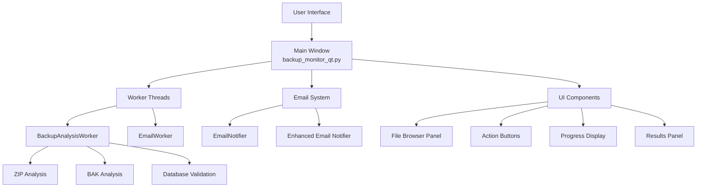
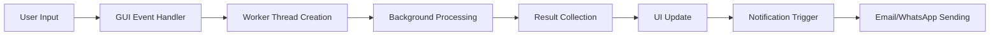
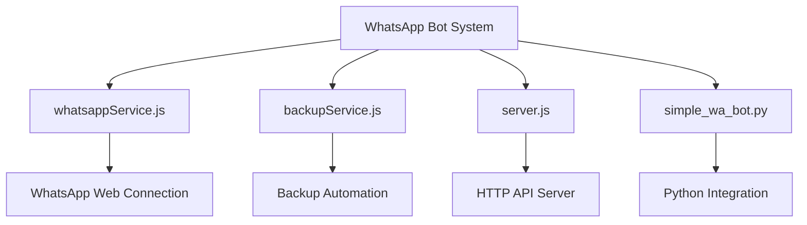
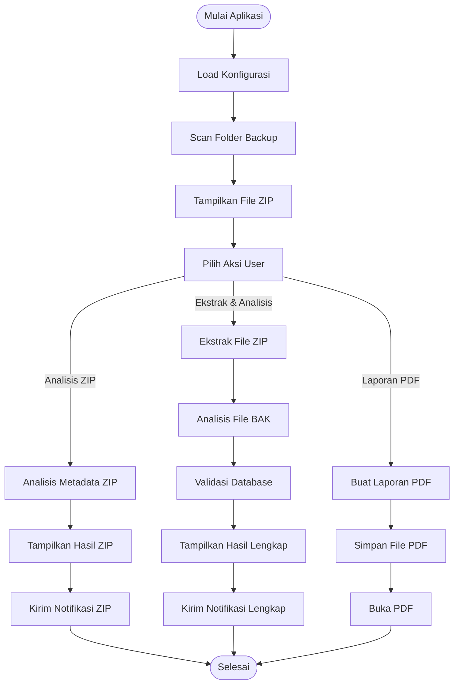
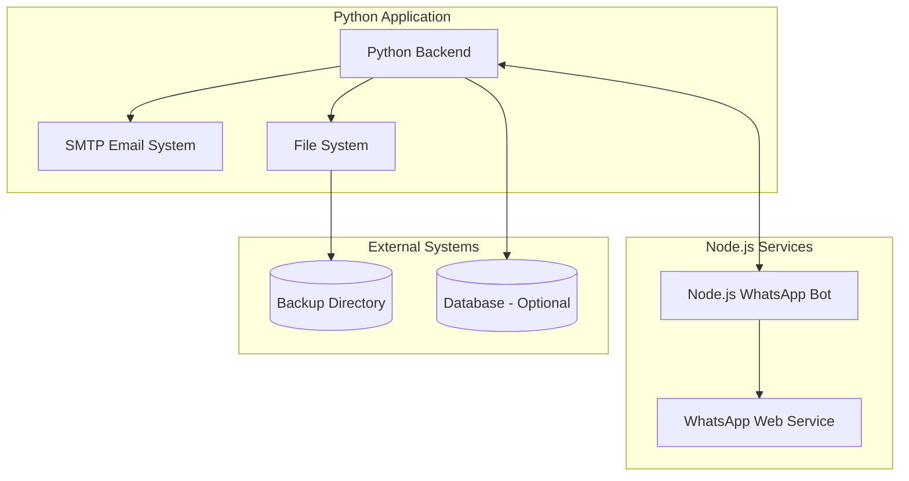
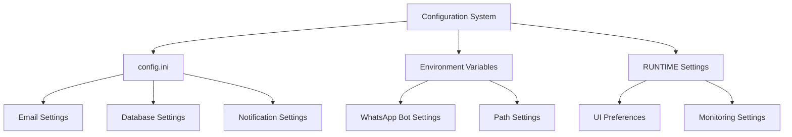

# Diagram Arsitektur Visual Aplikasi Backup Monitor

## Struktur Aplikasi Utama

## Modul Inti Aplikasi

```mermaid
graph TD
    Z[ZIP Processing Modules] --> Z1[zip_metadata_viewer.py]
    Z --> Z2[zip_validator.py]
    Z --> Z3[enhanced_zip_analyzer.py]
    
    B[BAK Processing Modules] --> B1[bak_metadata_analyzer.py]
    B --> B2[bak_file_reader.py]
    B --> B3[enhanced_bak_analyzer.py]
    B --> B4[tape_file_analyzer.py]
    
    D[Database Modules] --> D1[database_validator.py]
    D --> D2[enhanced_database_validator.py]
    D --> D3[quick_database_validator.py]
    
    R[Reporting Modules] --> R1[pdf_report_generator.py]
    R --> R2[email_notifier.py]
    R --> R3[enhanced_email_notifier.py]
    
    U[Utility Modules] --> U1[monitoring_controller.py]
    U --> U2[folder_monitor.py]
    U --> U3[gui.py]
```

## Arsitektur Aliran Data

## Komponen WhatsApp Bot

## Flow Monitoring Backup

## Integrasi Sistem

## Komponen Konfigurasi

