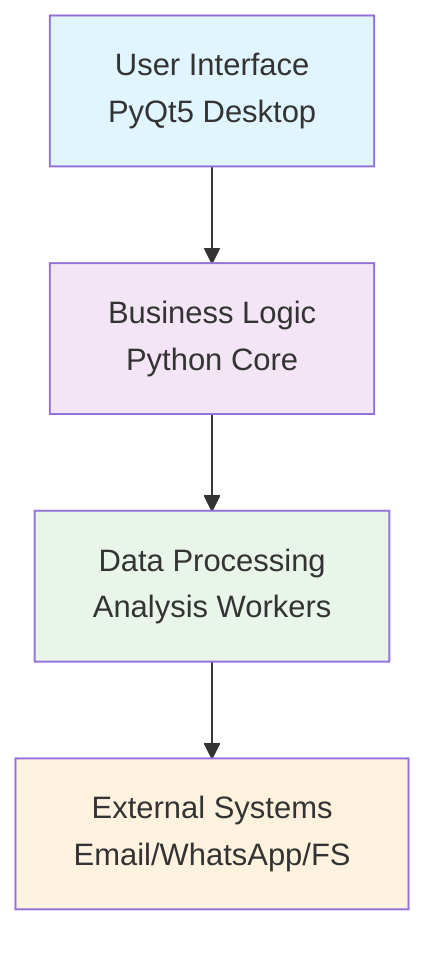
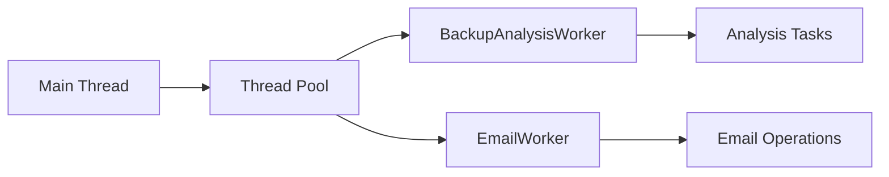
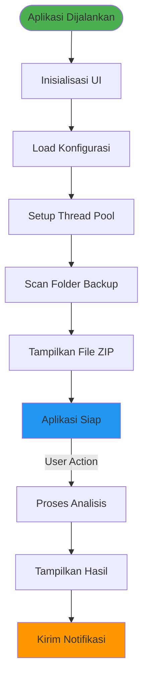
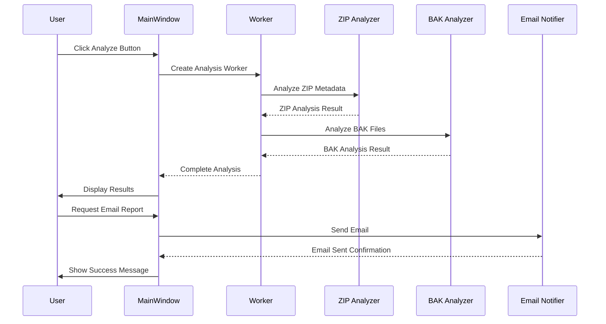
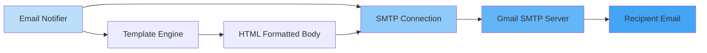
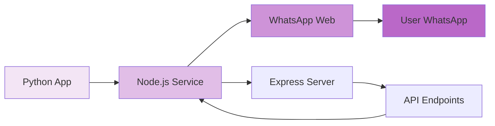
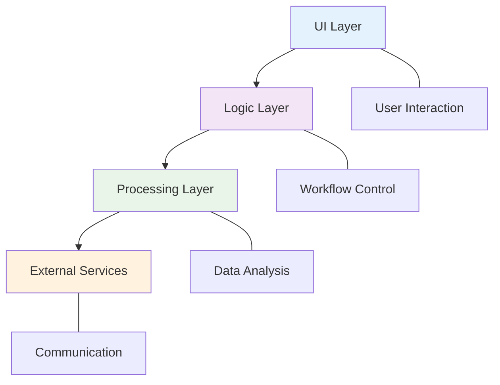
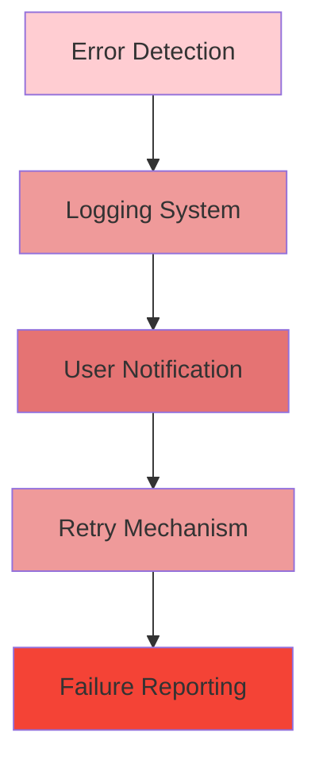

# Arsitektur Aplikasi Backup Monitor
## Presentasi Teknis

---

## Agenda

1. Gambaran Umum Aplikasi
2. Arsitektur Sistem
3. Komponen Utama
4. Workflow Aplikasi
5. Integrasi & Notifikasi
6. Keunggulan Arsitektur
7. Roadmap Pengembangan

---

## Gambaran Umum Aplikasi

### Fungsi Utama
- **Monitoring Backup Database** secara otomatis
- **Analisis File ZIP/BAK** untuk verifikasi integritas
- **Notifikasi Multi-channel** (Email & WhatsApp)
- **Laporan Komprehensif** dalam format PDF/HTML

### Teknologi Utama
- **Frontend**: Python + PyQt5 (Desktop GUI)
- **Backend**: Python Workers + Node.js Services
- **Komunikasi**: SMTP Email + WhatsApp Web API
- **Penyimpanan**: File System Lokal

---

## Arsitektur Sistem - Layered Approach



### Layer 1: User Interface
- Antarmuka desktop interaktif
- Real-time progress updates
- Visualisasi hasil analisis

### Layer 2: Business Logic
- Orkestrasi alur kerja
- Manajemen konfigurasi
- Kontrol thread workers

### Layer 3: Data Processing
- Analisis file backup
- Validasi integritas
- Ekstraksi metadata

### Layer 4: External Systems
- Notifikasi email
- Service WhatsApp
- Akses file sistem

---

## Komponen Utama Aplikasi

### Core Application (`backup_monitor_qt.py`)
- Entry point aplikasi desktop
- QMainWindow dengan layout terorganisir
- Thread pool management
- Event handling dan routing

### Worker System


### Analysis Modules
- **ZIP Analyzer**: `zip_metadata_viewer.py`
- **BAK Analyzer**: `bak_metadata_analyzer.py`
- **Database Validator**: `database_validator.py`
- **PDF Generator**: `pdf_report_generator.py`

---

## Workflow Aplikasi - Startup



### Startup Sequence
1. **Initialization Phase**
   - Setup PyQt5 application
   - Load configuration from `config.ini`
   - Initialize thread pool for background tasks
   - Setup UI components and layouts

2. **File Discovery**
   - Scan default backup directory
   - Parse ZIP file metadata
   - Display files in organized table view

3. **Ready State**
   - Application waits for user interaction
   - Background monitoring can be enabled
   - All systems operational

---

## Workflow Aplikasi - Analysis



### Analysis Steps
1. **ZIP File Analysis**
   - Metadata extraction (size, dates, compression)
   - Integrity verification
   - File listing and categorization

2. **BAK File Analysis**
   - SQL Server backup header parsing
   - Database metadata extraction
   - Validity verification

3. **Validation Phase**
   - Cross-reference file relationships
   - Check for corruption indicators
   - Determine restore capability

4. **Reporting**
   - Generate structured analysis results
   - Format for UI display
   - Prepare for email notification

---

## Integrasi & Notifikasi

### Email System


### WhatsApp Integration


### Notification Features
- **Multi-channel Delivery**
  - Email reports with attachments
  - WhatsApp messages with quick updates
  - Real-time status notifications

- **Template System**
  - HTML email templates
  - Rich message formatting
  - Dynamic content injection

- **Delivery Tracking**
  - Success/failure logging
  - Retry mechanisms
  - Error reporting

---

## Keunggulan Arsitektur

### 1. Separation of Concerns


### 2. Scalable Threading Model
- **Thread Pool Management**: Controlled resource usage
- **Asynchronous Processing**: Non-blocking UI operations
- **Load Distribution**: Parallel processing of multiple files

### 3. Modular Design
- **Plugin Architecture**: Easy addition of new analyzers
- **Component Reusability**: Shared modules across features
- **Independent Testing**: Unit testing for each module

### 4. Multi-platform Integration
- **Cross-service Communication**: Python ↔ Node.js bridge
- **Universal Notifications**: Email + WhatsApp + Future channels
- **Flexible Deployment**: Desktop, server, or cloud-ready

---

## Performance & Reliability

### Resource Management
- **Memory Efficient**: Streaming for large file processing
- **CPU Optimized**: Thread pooling and task queuing
- **Disk Smart**: Temporary file management and cleanup

### Error Handling


### Recovery Features
- **Graceful Degradation**: Partial functionality on component failure
- **Auto-retry**: Automatic retry for transient failures
- **State Preservation**: Maintain progress across restarts

---

## Security Considerations

### Credential Management
- **Encrypted Storage**: Configuration file protection
- **Environment Isolation**: Separate credential contexts
- **Access Control**: Permission-based file operations

### Data Protection
- **File Validation**: Sanitize file paths and operations
- **Content Inspection**: Validate file types and structures
- **Audit Logging**: Track all file operations and access

---

## Roadmap Pengembangan

### Short Term (Next Release)
1. **Enhanced Analytics Dashboard**
   - Interactive charts and graphs
   - Historical trend analysis
   - Predictive maintenance indicators

2. **Advanced Filtering**
   - Date range filtering
   - File size thresholds
   - Database-specific filters

3. **Performance Optimization**
   - Faster ZIP processing
   - Memory usage reduction
   - Caching improvements

### Medium Term (3-6 Months)
1. **Cloud Integration**
   ```mermaid
   graph LR
       A[Local App] --> B[Cloud Sync]
       B --> C[AWS/GCP/Azure]
       C --> D[Remote Storage]
       
       style A fill:#e8f5e8
       style B fill:#c8e6c9
       style C fill:#a5d6a7
       style D fill:#81c784
   ```

2. **AI-Powered Analysis**
   - Anomaly detection in backup patterns
   - Predictive failure analysis
   - Automated recommendations

3. **Extended Database Support**
   - MySQL backup analysis
   - PostgreSQL backup validation
   - MongoDB backup inspection

### Long Term (6+ Months)
1. **Enterprise Features**
   - Multi-user support
   - Role-based access control
   - Audit trails and compliance

2. **Mobile Companion App**
   ```mermaid
   graph LR
       A[Mobile App] --> B[REST API]
       B --> C[Core Application]
       C --> D[Notification Service]
       
       style A fill:#e3f2fd
       style B fill:#bbdefb
       style C fill:#90caf9
       style D fill:#64b5f6
   ```

3. **Containerization & Microservices**
   - Docker container deployment
   - Kubernetes orchestration
   - Service mesh architecture

---

## Kesimpulan

### Arsitektur yang Kuat
Aplikasi Backup Monitor menggunakan arsitektur modular dan terdistribusi yang:
- **Scalable**: Mendukung peningkatan beban dan fitur
- **Maintainable**: Mudah dikembangkan dan diperbaiki
- **Reliable**: Sistem fault-tolerance dan error handling
- **Extensible**: Integrasi mudah dengan sistem eksternal

### Value Proposition
- **Complete Solution**: Dari analisis hingga notifikasi
- **Multi-channel**: Email dan WhatsApp untuk fleksibilitas
- **User-friendly**: Antarmuka intuitif dengan feedback real-time
- **Enterprise-grade**: Fitur keamanan dan manajemen resource

### Future Potential
Arsitektur ini memberikan fondasi kuat untuk:
- Ekspansi ke platform cloud
- Integrasi AI/ML untuk predictive analytics
- Enterprise deployment dengan clustering
- Mobile-first monitoring experience

---